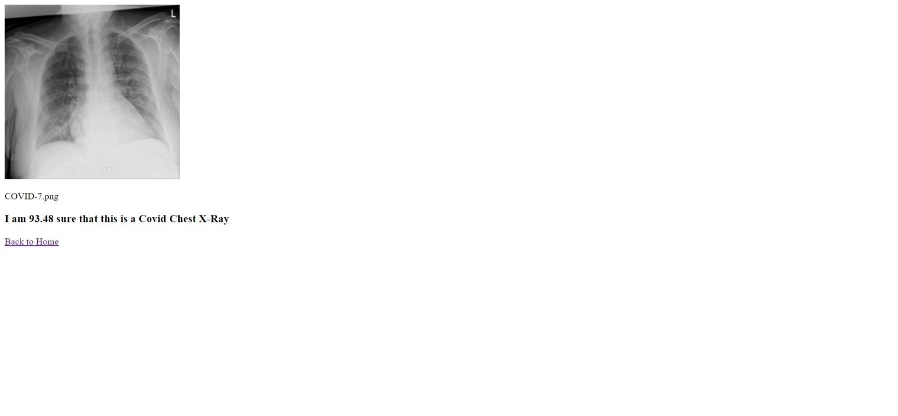

# Covid Detection App

Simple Flask app which accepts Chest X-Ray images from the user and identifies whether the patient is COVID+, has Pneumonia (or Lung Opacity due to non-COVID lung infection), or is Normal. 

Currently, the app makes use of the **ResNet50** model API from Keras which has been trained from scratch using the [COVID-19 Radiography Database](https://www.kaggle.com/tawsifurrahman/covid19-radiography-database) from Kaggle.

This app has been deployed on Heroku. 

[Click here to test it out!](https://chest-xray-analysis-model.herokuapp.com/)

### To Do:
1. Improve the looks of the webpage; it is really barebones at the moment.
2. Try and test out different models to achieve better accuracy.